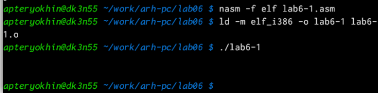

**РОССИЙСКИЙ УНИВЕРСИТЕТ ДРУЖБЫ НАРОДОВ Факультет физико-математических и естественных наук Кафедра математики и механики**

**ОТЧЕТ**

**ПО ЛАБОРАТОРНОЙ РАБОТЕ №6** *дисциплина: Архитектура компьютера*

Студент: Терёхин Александр Павлович Группа: НММбД-03-24

**МОСКВА** 2024г.

**Оглавление**

1. [Цель работы................................................................................................................................3](#_page2_x250.05_y56.70)
1. [Задание........................................................................................................................................4](#_page3_x271.60_y56.70)
1. [Выполнение лабораторной работы..........................................................................................5](#_page4_x149.45_y56.70)
1. Выполнение самостоятельной работы.....................................................................................6
1. [Вывод.......................................................................................................................................... 7](#_page14_x283.30_y56.70)
1. **Цель работы**

Целью  работы  является  освоение  арифметических  инструкций  языка ассемблера NASM.

2. **Задание**
1. Символьные и численные данные в Nasm.
1. Выполнение арифметических операций в Nasm.

1\.2. Задание для самостоятельной работы

В  ходе  лабораторной  работы  необходимо  освоить  арифметические инструкции языка ассемблера NASM.

3. **Выполнение лабораторной работы**
1. **Символьные и численные данные в  Nasm**

Создаю каталог для программ лабораторной №6. Перехожу в него и создаю файл lab6-1.asm (рис. 1).

Рис. 1. Создание каталога и файла

Ввожу в созданный файл текст программы из листинга (рис. 2).

Рис. 2. Написание программы

Копирую файл in\_out.asm в каталог для программ лабораторной работы №6 

(рис. 3).

Рис. 3. Копирование файла Создаю исполняемый файл и запускаю его (рис. 4).

Рис. 4. Выполнение программы

Изменяю текст программы, вместо символов записывая в eax, ebx числа (рис. 

5).

Рис. 5. Изменение программы Создаю исполняемый файл и запускаю его (рис. 6).

Рис. 6. Выполнение программы

На экране ничего не отображается. Это связано с тем, что символ с кодом 10 

\- это символ перевода строки.

Создаю файл lab6-2.asm в каталоге для программ лабораторной №6. Ввожу в него текст программы из листинга 6.2 (рис. 7).

Рис. 7. Создание файла и написание программы Создаю исполняемый файл и запускаю его (рис. 8).

Рис. 8. Выполнение программы

Аналогично предыдущей программе заменяю символы на числа (рис. 9).

Рис. 9. Изменение программы Создаю исполняемый файл и запускаю его (рис. 10).

Рис. 10. Выполнение программы

Теперь программа складывает не коды, соответствующие символам, а сами числа. Поэтому выводит число 10 - сумму чисел 4 и 6.

Заменяю функцию iprintLF на iprint (рис. 11).

Рис. 11. Изменение программы Создаю исполняемый файл и запускаю его (рис. 12).

Рис. 12. Выполнение программы

Вывод функции iprintLF от вывода функции iprint отличается тем, что в последнем случае после вывода не добавляется переход на новую строку.

2. **Выполнение арифметических операций в Nasm**
1. Создаю файл lab6-3.asm. Ввожу в него текст программы для вычисления значения указанного выражения (рис. 13).

Рис. 13. Создание файла и написание программы

2. Создаю исполняемый файл и запускаю его (рис. 14).

Рис. 14. Выполнение программы

Изменяю текст программы для вычисления нового выражения (рис. 15).

Рис. 15. Изменение программы

Создаю исполняемый файл и запускаю его (рис. 16).

Рис. 16. Выполнение программы

С помощью утилиты touch создаю файл variant.asm. Ввожу в него текст программы для вычисления варианта (рис. 17).

Рис. 17. Создание файла и написание программы

Создаю исполняемый файл и запускаю его (рис. 18).

Рис. 18. Выполнение программы

Ответы на вопросы по программе: 1. За вывод сообщения “Ваш вариант” отвечают 

строки кода:

mov eax,rem

call sprint

2. Инструкция mov ecx, x выполняется для того чтобы положить адрес вводимой строки x в регистр ecx. Инструкция mov edx, 80 выполняется для записи длины вводимой строки в регистр edx. Инструкция call sread выполняется для вызова подпрограммы из внешнего файла, обеспечивающей ввод сообщения с клавиатуры.
2. Инструкция call atoi используется для вызова подпрограммы из внешнего файла, которая преобразует ascii-код символа в целое число и записывает результат в регистр eax.
2. За вычисление варианта отвечают строки:

xor edx, edx

mov ebx, 20

div ebx

inc edx

5. При выполнении инструкции div ebx остаток от деления записывается в регистр edx.
5. Инструкция inc edx увеличивает значение регистра edx на 1.
5. За вывод на экран результата вычислений отвечаю следующие строки:

mov eax,edx call iprintLF

4. **Выполнение самостоятельной работы**

Создаю файл lab6-4.asm и записываю в него программу для вычисления выражения 18 варианта. (рис. 19).

Рис. 19. Создание файла и написание программы

Создаю исполняемый файл и проверяю его работу для указанных значений (рис. 20)

5. **Вывод**

При выполнении данной лабораторной работы я освоила арифметические инструкции языка ассемблера NASM.
