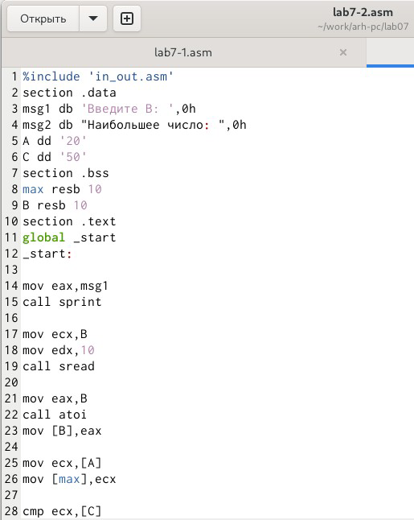
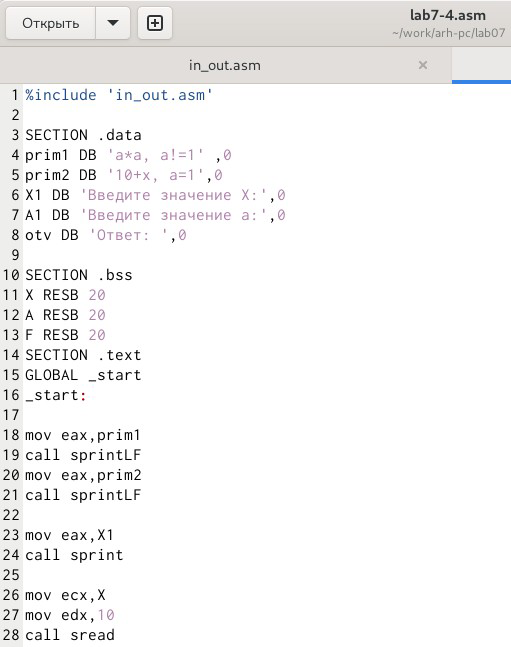

**РОССИЙСКИЙ УНИВЕРСИТЕТ ДРУЖБЫ НАРОДОВ Факультет физико-математических и естественных наук Кафедра математики и механики**

**ОТЧЕТ**

**ПО ЛАБОРАТОРНОЙ РАБОТЕ №7** *дисциплина: Архитектура компьютера*

Студент: Терёхин Александр Павлович Группа: НММбД-03-24

**МОСКВА** 2024г.

**Оглавление**

1. [Цель работы................................................................................................................................3](#_page2_x250.05_y56.70)
1. [Задание........................................................................................................................................4](#_page3_x271.60_y56.70)
1. [Выполнение лабораторной работы..........................................................................................5 ](#_page4_x149.45_y56.70)[3 Самостоятельная работа...........................................................................................................10 ](#_page9_x85.05_y394.65)[4 Вывод......................................................................................................................................... 14](#_page13_x85.05_y56.70)
1. **Цель работы**

Изучение  команд  условного  и  безусловного  переходов.  Приобретение навыков  написания  программ  с  использованием  переходов.  Знакомство  с назначением и структурой файла листинга.

2. **Задание**
1. Реализация переходов в NASM.
1. Изучение структуры файлы листинга

1\.2. Задание для самостоятельной работы

В ходе лабораторной работы необходимо научиться реализовывать переходы в NASM и изучить структуры файлов листинга.

3. **Выполнение лабораторной работы**

Я создал каталог lab7 и внутри создал файл lab7-1.asm

*Рис. 1: Cоздание файла lab7-1.asm*

2. Я ввел в файл текст программы и запустил его.

*Рис. 2: Текст в файле lab7-1.asm*

3. Я создал исполняемый файл и запустил его. Результат соответствовал нужному.

*Рис. 3: Запуск программы lab7-1*

4)Я изменил текст программы чтобы выводился нужный ответ и создал исполняемый файл.

*Рис. 4: Изменение текста*

*Рис. 5: Проверка работы программы*

5)Я изменил текст программы чтобы сначала выводило сообщение 3,затем 2, затем 1.

*Рис. 6: Изменение текста*

6) Запустил программу и проверил ее работу.

*Рис. 7: Запуск программы*

7) Я создал файл lab8-2.asm и написал текст программы.

*Рис. 8: Текст программы для сравнения чисел*

8) Я ввел два разных числа чтобы проверить как работает программа.

*Рис. 9: Программа для сравнения чисел*

9) Я создал файл листинга lab7-2.lst и открыл его.

*Рис. 10: Файл листинга lab7-2.lst*

10) Проанализировав файл, я понял как он работает и какие значения выводит.
10) Эта строка находится на 24 месте, ее адрес “00000101”, Машинный код - В8 [0A000000], а mov eax,B - исходный текст программы, означающий что в регистр eax мы вносим значения переменной B.

*Рис. 11: Объяснения первой строки*

12) *Эта строка находится на 38 месте, ее адрес “00000134”, Машинный код -* 

*E863FFFFFF, а call atoi - исходный текст программы, означающий что символ лежащий в строке выше переводится в число.*

*Рис. 12: Объяснения второй строки*

13) *Эта строка находится на 50 месте, ее адрес “00000162”, Машинный код -* 

*A1[00000000], а mov eax,[max] - исходный текст программы, означающий что число хранившееся в переменной max записывается в регистр eax.*

*Рис. 13: Объяснения третьей строки*

14) *В строке mov eax,max я убрал max и попробовал создать файл. Выдало ошибку, так* 

*как для программы нужно два операнда.*

*Рис. 14: Создание файла без одного операнда*

15) *В файле листинга показывает где именно ошибка и с чем она связана.*

*Рис. 15: Файл листинга без одного операнда*

3  **Самостоятельная работа.**
1) Я написал программу для нахождения меньшего из трех чисел. Для большего удобства я сделал ввод чисел с клавиатуры. У меня 18 вариант поэтому числа были : 83, 73, 30. Программа вывела меньшее из этих чисел.

*Рис. 16: Текст программы*

*Рис. 17: Результат работы программы*

2) Я написал программу, чтобы она вычисляла выражение при введенных Х и А. Для большего удобства, выражение которое будет вычисляться я вывожу вначале работы программы. Так как у меня 18 вариант, то программа написана для 18 варианта.

*Рис. 18: Текст программы*

*Рис. 19: Проверка работы программы*

4  **Вывод**

Я изучил команды условного и безусловного перехода. Приобрел навыки написания программ с переходами.
