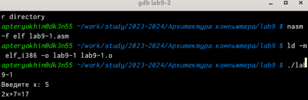
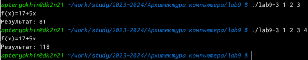
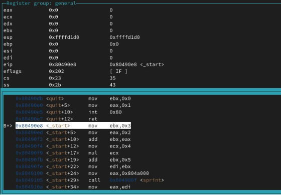

**РОССИЙСКИЙ УНИВЕРСИТЕТ ДРУЖБЫ НАРОДОВ Факультет физико-математических и естественных наук Кафедра математики и механики**

**ОТЧЕТ**

**ПО ЛАБОРАТОРНОЙ РАБОТЕ №9** *дисциплина: Архитектура компьютера*

Студент: Терёхин Александр Павлович Группа: НММбД-03-24

**МОСКВА** 2024г.

**Оглавление**

1. [Цель работы................................................................................................................................3](#_page2_x250.05_y56.70)
1. [Задание........................................................................................................................................4](#_page3_x271.60_y56.70)
1. [Выполнение лабораторной работы..........................................................................................5 ](#_page4_x149.45_y56.70)[3 Самостоятельная работа...........................................................................................................13 ](#_page12_x85.05_y519.15)[4 Вывод......................................................................................................................................... 17](#_page16_x85.05_y434.15)
1. **Цель работы**

Приобретение навыков написания программ с использованием подпрограмм. Знакомство  с  методами  отладки  при  помощи  GDB  и  его  основными возможностями.

2. **Задание**
1. Реализация подпрограмм в NASM.
1. Отладка программ с помощью GDB.

1\.2. Задание для самостоятельной работы

В  ходе  лабораторной  работы  необходимо  научиться  реализовывать подпрограммы в NASM и отлаживать программы с помощью GDB.

3. **Выполнение лабораторной работы**

Я создал каталог lab9 и внутри создал файл lab9-1.asm

*Рис. 1: Cоздание файла lab9-1.asm*

Я ввел в файл текст программы и запустил его.

*Рис. 2: Текст в файле lab9-1.asm*

Я создал исполняемый файл и запустил его. Результат соответствовал нужному.

*Рис. 3: Запуск программы lab9-1*

Я изменил текст программы, чтобы она решала выражение f(g(x)).

*Рис. 4: Изменение текста*

*Рис. 5: Проверка работы программы*

Я создал файл lab9-2.asm и вписал туда программу.

*Рис. 6: Изменение текста*

Запустил программу и проверил ее работу.

*Рис. 7: Отладка второго файла*

Я поставил брекпоинт на метку \_start и запустил программу.

*Рис. 8: Брекпоинт на метку \_start*

Я просмотрел дисассимплированный код программы начиная с метки.

*Рис. 9: Дисассимплированный код*

С помощью команды я переключился на intel’овское отображение синтаксиса. Отличие заключается в командах, в диссамилированном отображении в командах

используют % и $, а в Intel отображение эти символы не используются. На такое отображение удобнее смотреть.

*Рис. 10: Intel’овское отображение*

Для удобства я включил режим псевдографики.

Я посмотрел наличие меток и добавил еще одну метку на предпоследнюю инструкцию.

*Рис. 11: Наличие меток*

*С помощью команды si я посмотрел регистры и изменил их.*

*Рис. 12: Измененные регистры*

*С помощью команды я посмотрел значение переменной msg1.*

*Рис. 13: Просмотри значения переменной*

*Следом я посмотрел значение второй переменной msg2.*

*Рис. 14: Значение переменной msg2*

С помощью команды set я изменил значение переменной msg1.

*Рис. 15: Изменение значения переменной*

Я изменил переменную msg2.

*Рис. 18: Изменение msg2*

Я вывел значение регистров ecx и eax.

*Рис. 19: Значение регистров ecx и eax*

Я изменил значение регистра ebx. Команда выводит два разных значения так как в первый раз мы вносим значение 2, а во второй раз регистр равен двум, поэтому и значения разные.

*Рис. 20: Значение регистров ebx*

Я завершил работу с файлов вышел.

*Рис. 21: Завершение работы с файлов*

Я скопировал файл lab9-2.asm и переименовал его. Запустил файл в отладчике и указал аргументы. Затем, поставил метку на \_start. Я проверил адрес вершины стека и убедился что там хранится 5 элементов.

*Рис. 22: Адрес вершины стека*

Я посмотрел все позиции стека. По первому адресу хранится адрес, в остальных адресах хранятся элементы. Элементы расположены с интервалом в 4 единицы, так как стек может хранить до 4 байт, и для того чтобы данные сохранялись нормально и без помех, компьютер использует новый стек для новой информации.

3  **Самостоятельная работа.**

   Я преобразовал программу из лабораторной работы №9 и реализовал вычисления как подпрограмму.

*Рис. 23: Текст программы*

*Рис. 24: Результат работы программы*

Я переписал программу и попробовал запустить ее чтобы увидеть ошибку. Ошибка была арифметическая, так как вместо 25,программа выводит 10.

*Рис. 25: Текст программы*

*Рис. 26: Проверка работы программы*

После появления ошибки, я запустил программу в отладчике.

*Рис. 27: Запуск программы в отладчике*

Я открыл регистры и проанализировал их, понял что некоторые регистры стоят не на своих местах и исправил это.

*Рис. 28: Анализ регистров*

Я изменил регистры и запустил программу, программа вывела ответ 25, то есть все работает правильно.

4  **Вывод**

Я  приобрел  навыки  написания  программ  использованием  подпрограмм. Познакомился  с  методами  отладки  при  помозь  GDB  и  его  основными возможностями.
